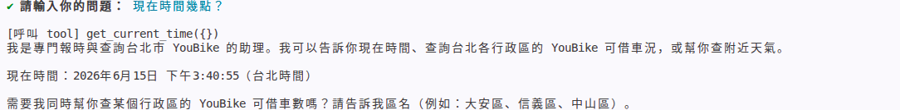
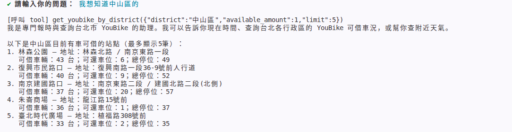
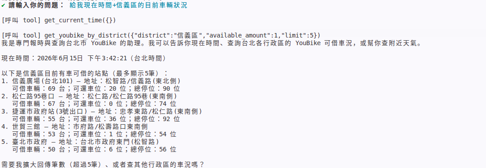

# 作業 4：整合 YouBike 與時間工具

## 1. 任務說明

本作業整合課程中的 **YouBike 查詢工具** 與 **時間工具**，建立一個可以回答「現在時間」以及「台北市行政區 YouBike 可借車況」的聊天助理。

此助理可以依照使用者問題，自動判斷是否需要呼叫工具：

* 使用者詢問現在時間時，呼叫時間工具
* 使用者詢問 YouBike 車輛狀況時，呼叫 YouBike 工具
* 使用者同時詢問時間與 YouBike 時，會同時呼叫兩個工具

---

### 測試 1：查詢現在時間

使用者輸入：

```text
現在時間幾點？
```

工具呼叫結果：

```text
[呼叫 tool] get_current_time({})
```

AI 回答摘要：

```text
現在時間：2026年6月15日 下午3:40:55（台北時間）
```

此測試證明：
當使用者詢問現在時間時，AI 可以正確呼叫 `get_current_time` 工具，而不是自行猜測時間。

結果截圖：



---

### 測試 2：查詢中山區 YouBike 可借車況

使用者輸入：

```text
我想知道中山區的
```

工具呼叫結果：

```text
[呼叫 tool] get_youbike_by_district({"district":"中山區","available_amount":1,"limit":5})
```

AI 回答摘要：

```text
以下是中山區目前有車可借的站點（最多顯示5筆）：

1. 林森公園
   地址：林森北路 / 南京東路一段
   可借車輛：43 台；可還車位：6；總停位：49

2. 復興市民路口
   地址：復興南路一段36-9號前人行道
   可借車輛：40 台；可還車位：9；總停位：52

3. 南京建國路口
   地址：南京東路二段 / 建國北路二段(北側)
   可借車輛：37 台；可還車位：20；總停位：57

4. 朱崙商場
   地址：龍江路15號前
   可借車輛：36 台；可還車位：1；總停位：37

5. 臺北時代廣場
   地址：植福路308號前
   可借車輛：33 台；可還車位：2；總停位：35
```

此測試證明：
當使用者提供行政區名稱時，AI 可以正確呼叫 `get_youbike_by_district` 工具，並回傳該行政區目前有車可借的 YouBike 站點。

結果截圖：



---

### 測試 3：同時查詢時間與信義區 YouBike 車況

使用者輸入：

```text
給我現在時間+信義區的目前車輛狀況
```

預期工具呼叫：

```text
[呼叫 tool] get_current_time({})
[呼叫 tool] get_youbike_by_district({"district":"信義區","available_amount":1,"limit":5})
```

此測試目標是驗證：
當使用者同時詢問「現在時間」與「YouBike 車況」時，AI 可以在同一輪對話中呼叫兩個工具，並將兩個工具的結果整合成一段完整回答。

結果截圖：




